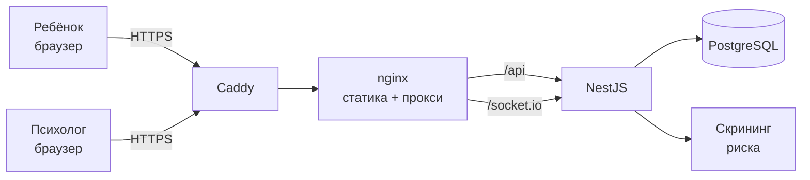

<h1 align="center">Рядом</h1>

<p align="center">
  Анонимный чат с психологом для детей, столкнувшихся с травлей.<br>
  Без регистрации, без имени, без анкеты — ребёнок открывает сайт и сразу пишет.
</p>

<p align="center">
  
  
  
  
  
  
</p>

---

## Если тебе нужна помощь прямо сейчас

Этот репозиторий — код, а не служба поддержки. Если ты ищешь помощь для себя:

- **112** — экстренные службы, если есть угроза жизни или здоровью
- **8 800 2000 122** — детский телефон доверия, круглосуточно, бесплатно,
  анонимно, по всей России

---

## Статус проекта

Рабочий пилот. Код собирается, разворачивается и работает, но **запускать его
для настоящих детей без организационной части нельзя**: нужны договоры с
лицензированными психологами, протокол эскалации кризисных ситуаций и правовые
документы. Подробности — в [SECURITY.md](SECURITY.md).

---

## Что умеет

**Экран ребёнка**

- вход сразу в разговор: приветствие психолога уже написано, курсор в поле ввода
- готовые фразы для тех, кому трудно начать («Меня травят в школе», «Мне тревожно»)
- «Быстро закрыть» в шапке и тройное нажатие `Esc` — мгновенный уход на нейтральный сайт
- разговор сохраняется на устройстве: можно закрыть сайт, выключить телефон и
  вернуться к тому же психологу и той же переписке
- на общем устройстве режим «помнить» отключается одним переключателем
- кнопка полного удаления диалога — стирает и на сервере
- диалоги без активности дольше `CONVERSATION_TTL_DAYS` удаляются автоматически
- автоматическое переподключение при обрыве связи
- телефоны экстренной помощи видны всегда
- телефон как основное устройство: высота экрана считается по `visualViewport`,
  поэтому клавиатура не выталкивает шапку и ленту за край; учтены вырез камеры
  и полоса жестов

**Скрининг риска**

Каждое сообщение проверяется по списку кризисных маркеров. При совпадении диалог
поднимается в начало очереди, психологу уходит оповещение, а ребёнок сразу видит
записку с телефонами — не дожидаясь, пока освободится специалист.

**Панель психолога**

Очередь диалогов с приоритетом по риску, история переписки, ответ в реальном
времени. Намеренно минимальная — это главная точка роста проекта.

---

## Скриншот

<!-- Положи изображение в docs/screenshot.png и раскомментируй строку ниже -->
<!--  -->

---

## Стек

| Слой | Технологии |
|---|---|
| Фронтенд | Vue 3, TypeScript, Vite, Pinia, Socket.IO-client |
| Бэкенд | NestJS, TypeScript, Socket.IO, Prisma |
| База | PostgreSQL 16 |
| Инфраструктура | Docker Compose, nginx, Caddy с автоматическим Let's Encrypt |

Дизайн-система собственная, без UI-библиотек: палитра и типографика живут в
[`frontend/src/styles/tokens.css`](frontend/src/styles/tokens.css).

---

## Быстрый старт

Нужны Docker с Compose v2 и около 2 ГБ свободного места.

```bash
git clone https://github.com/<аккаунт>/antibulling.git
cd antibulling
cp .env.example .env      # Windows: Copy-Item .env.example .env
```

Открой `.env` и задай свои значения. Обязательное требование: `OPERATOR_PASSWORD`
не короче 8 символов, иначе учётная запись психолога не создастся.

```bash
docker compose up --build
```

Через 3–6 минут:

| Что | Адрес |
|---|---|
| Экран ребёнка | http://localhost:8080 |
| Панель психолога | http://localhost:8080/psy |
| Проверка живости API | http://localhost:8080/api/health |

Чтобы увидеть обе стороны разговора, открой второе окно браузера в приватном
режиме. Остановить: `docker compose down`, вместе с базой — `docker compose down -v`.

---

## Разработка

В Docker остаётся только база, остальное запускается локально — так Vite мгновенно
подхватывает правки стилей.

```bash
# терминал 1
docker compose up db

# терминал 2
cd backend
npm install
cp ../.env .env               # в DATABASE_URL замени host db на localhost
npx prisma generate
npx prisma migrate deploy
npm run start:dev

# терминал 3
cd frontend
npm install
npm run dev                   # http://localhost:5173
```

Vite проксирует `/api` и WebSocket на порт 3000, так что CORS настраивать не нужно.

**Проверка на телефоне.** Эмуляция устройства в браузере не воспроизводит
поведение экранной клавиатуры — тестировать нужно на реальном телефоне. Узнай
локальный адрес компьютера (`ipconfig` на Windows, `ip a` на Linux) и открой на
телефоне `http://<адрес>:5173`; телефон и компьютер должны быть в одной сети.
Vite уже слушает все интерфейсы.

Полезные команды:

```bash
npm run typecheck             # frontend: проверка типов в .vue
npx prisma studio             # backend: просмотр базы в браузере
docker compose logs -f backend
```

На Windows перед работой в PowerShell выполни `chcp 65001`, иначе русские логи
превращаются в `╨Р╨╜╤П`.

---

## Как устроено



Разговор идёт по WebSocket. Каждый диалог — отдельная комната Socket.IO; ребёнок
попадает в неё по токену, психолог — по JWT после входа в панель.

**Как работает возвращение.** Токен лежит в `localStorage` и обновляет отметку
времени при каждом заходе, поэтому 30 дней бездействия обнуляют его на
устройстве, а не 30 дней с начала разговора. Если психолог успел закрыть диалог,
новое сообщение ребёнка возвращает его в очередь. После долгой паузы в ленте
появляется тихая отметка, чтобы старая переписка не выглядела как происходящее
прямо сейчас.

**Как работает анонимность.** При первом заходе сервер выдаёт случайный
256-битный токен, который остаётся в браузере. В базе хранится только его
`sha256`, поэтому даже полный доступ к данным не позволяет восстановить токен и
войти в чужой диалог. Психолог видит псевдоним вида «Гость-4821». Ни имени, ни
телефона, ни почты ребёнок нигде не вводит.

---

## Структура

```
antibulling/
├─ docker-compose.yml          локальная разработка
├─ docker-compose.prod.yml     прод: Caddy, HTTPS, закрытая внутренняя сеть
├─ Caddyfile
├─ backend/
│  ├─ prisma/                  схема БД и миграции
│  └─ src/
│     ├─ session/              создание анонимного диалога, удаление
│     ├─ chat/                 Socket.IO-шлюз и логика сообщений
│     ├─ safety/               скрининг кризисных маркеров
│     └─ operator/             вход психолога
├─ frontend/
│  ├─ nginx.conf               заголовки безопасности и проксирование
│  └─ src/
│     ├─ styles/tokens.css     палитра, типографика, тени
│     ├─ views/                экран ребёнка и панель психолога
│     └─ components/
└─ docs/DEPLOYMENT.md          развёртывание на сервере
```

---

## Развёртывание

Продакшен-конфигурация поднимает Caddy с автоматическим сертификатом Let's
Encrypt; наружу открыт только он, база и API живут во внутренней сети Docker.

```bash
docker compose -f docker-compose.prod.yml up -d --build
```

Полная инструкция, включая настройку домена, закрытие пилота паролем, обновление
версии и резервное копирование — в [docs/DEPLOYMENT.md](docs/DEPLOYMENT.md).

---

## Безопасность

Что уже закрыто и чего не хватает до публичного запуска — в
[SECURITY.md](SECURITY.md). Там же способ сообщить об уязвимости.

Коротко о главном: переписка ребёнка о травле и самочувствии относится к
сведениям о здоровье, то есть к специальной категории персональных данных по
152-ФЗ, даже без имени. Анонимность снижает риск, но не выводит проект из-под
закона.

**Никогда не коммить `.env`** — он в `.gitignore`. Секреты переносятся на сервер
руками.

---

## Дорожная карта

- [ ] Полноценная панель психолога: несколько специалистов, смены, передача диалога
- [ ] Журнал действий специалистов
- [ ] Срок жизни диалогов и автоматическое удаление старых
- [ ] Отзыв сессий психолога, двухфакторная аутентификация
- [ ] Шифрование сообщений в базе
- [ ] Самостоятельная раздача шрифтов вместо Google Fonts
- [ ] Redis для общего счётчика ограничений при нескольких экземплярах бэкенда
- [ ] Мониторинг и оповещения о падении
- [ ] Расширение словаря кризисных маркеров вместе с методистом

---

## Участие в разработке

Проект касается детей в уязвимом состоянии, поэтому к правкам два требования
сверх обычных:

1. Любое изменение текстов интерфейса или логики скрининга риска согласуется со
   специалистом, а не принимается по вкусу разработчика
2. Новый код не должен запрашивать у ребёнка персональные данные ни в каком виде

В остальном обычный порядок: форк, ветка, понятное описание в pull request.
Перед отправкой прогони `npm run typecheck` во фронтенде и `npm run build` в
бэкенде.

---

## Лицензия

Лицензия пока не выбрана. Пока файла `LICENSE` нет, код по умолчанию защищён
авторским правом и не может использоваться другими. Если планируется открытая
разработка, добавь лицензию — для такого проекта обычно подходят MIT или
Apache-2.0.
